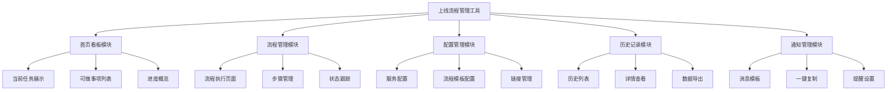
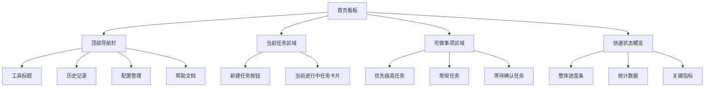
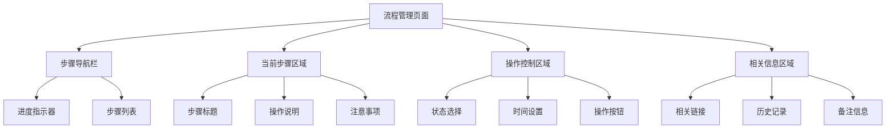
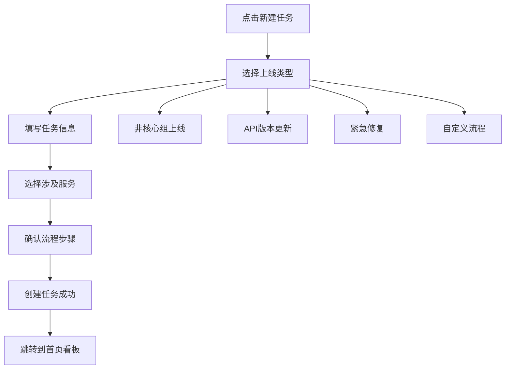
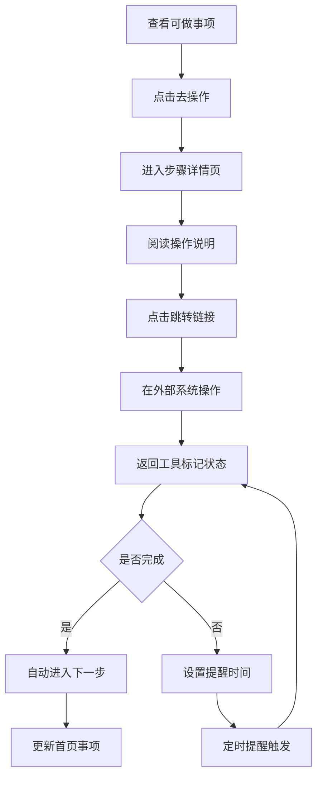
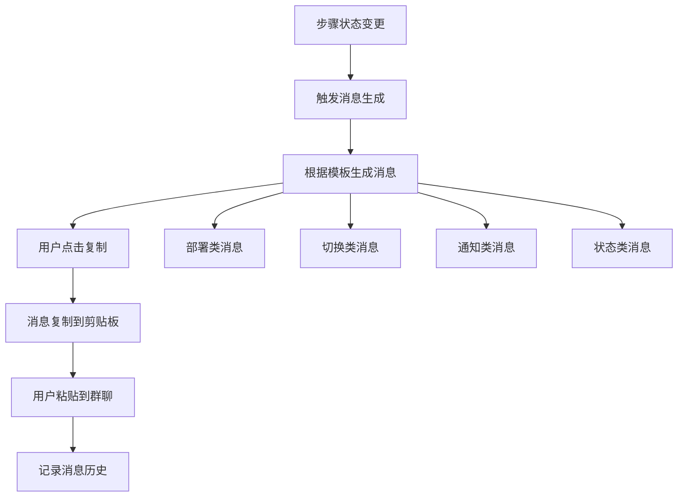
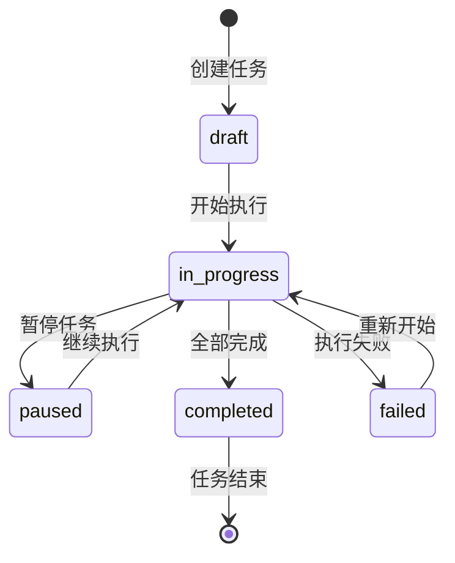
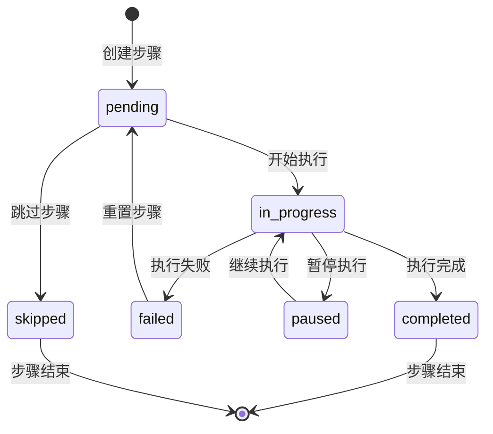
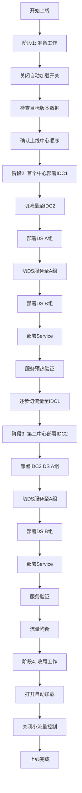
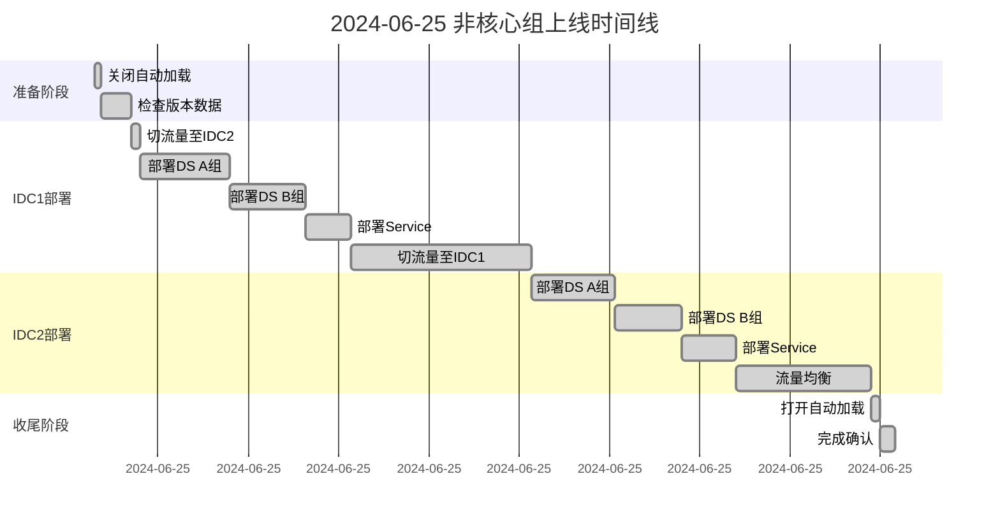

# 上线流程管理工具 - 产品需求文档

## 目录

- [1. 产品概述](#1-产品概述)
  - [1.1 产品定位](#11-产品定位)
  - [1.2 核心价值](#12-核心价值)
  - [1.3 用户画像](#13-用户画像)
- [2. 系统架构设计](#2-系统架构设计)
  - [2.1 技术架构](#21-技术架构)
  - [2.2 模块架构](#22-模块架构)
- [3. 数据库设计](#3-数据库设计)
  - [3.1 数据表结构](#31-数据表结构)
- [4. 页面设计与原型](#4-页面设计与原型)
  - [4.1 首页看板设计](#41-首页看板设计)
  - [4.2 流程管理页面设计](#42-流程管理页面设计)
- [5. 核心功能规格](#5-核心功能规格)
  - [5.1 首页看板模块](#51-首页看板模块)
  - [5.2 流程管理模块](#52-流程管理模块)
  - [5.3 消息模板配置](#53-消息模板配置)
- [6. 交互逻辑设计](#6-交互逻辑设计)
- [7. 技术实现方案](#7-技术实现方案)
- [8. 开发计划](#8-开发计划)
- [9. 数据流设计](#9-数据流设计)
- [10. 部署和运维](#10-部署和运维)
- [附录：示例数据](#附录示例数据)

---

## 1. 产品概述

### 1.1 产品定位
个人使用的上线流程辅助管理工具，帮助管理复杂的多环境、多服务部署流程，提供实时状态跟踪、操作提醒和历史记录功能。

### 1.2 核心价值
- **防止遗忘**：清晰展示当前进度和下一步操作
- **提高效率**：一键跳转到操作页面，一键复制通知消息
- **风险控制**：超时提醒，确保关键步骤不被遗漏
- **历史追溯**：完整记录每次上线过程，支持复盘

### 1.3 用户画像
- **主要用户**：运维工程师、发布工程师
- **使用场景**：复杂的多环境服务上线部署
- **痛点**：流程复杂、步骤繁多、容易遗忘、缺乏状态管理

## 2. 系统架构设计

### 2.1 技术架构
```
┌─────────────────────────────────────────────────────────┐
│                    前端层 (React + TS)                    │
├─────────────────────────────────────────────────────────┤
│                   后端API层 (Node.js)                     │
├─────────────────────────────────────────────────────────┤
│                  数据持久层 (SQLite)                       │
└─────────────────────────────────────────────────────────┘
```

### 2.2 模块架构图



## 3. 数据库设计

### 3.1 数据表结构

```sql
-- 上线任务表
CREATE TABLE tasks (
    id INTEGER PRIMARY KEY AUTOINCREMENT,
    name VARCHAR(255) NOT NULL,
    description TEXT,
    status VARCHAR(50) NOT NULL, -- draft, in_progress, completed, paused, failed
    start_time DATETIME,
    end_time DATETIME,
    config_snapshot TEXT, -- JSON格式保存配置快照
    created_time DATETIME DEFAULT CURRENT_TIMESTAMP,
    updated_time DATETIME DEFAULT CURRENT_TIMESTAMP
);

-- 任务步骤表
CREATE TABLE task_steps (
    id INTEGER PRIMARY KEY AUTOINCREMENT,
    task_id INTEGER NOT NULL,
    step_order INTEGER NOT NULL,
    step_name VARCHAR(255) NOT NULL,
    step_type VARCHAR(100) NOT NULL, -- deploy, switch, verify, notify
    status VARCHAR(50) NOT NULL, -- pending, in_progress, completed, failed, skipped
    start_time DATETIME,
    end_time DATETIME,
    estimated_duration INTEGER, -- 预估耗时（分钟）
    actual_duration INTEGER, -- 实际耗时（分钟）
    notes TEXT,
    reminder_time DATETIME,
    dependencies TEXT, -- JSON格式保存依赖关系
    service_config TEXT, -- JSON格式保存服务相关配置
    created_time DATETIME DEFAULT CURRENT_TIMESTAMP,
    FOREIGN KEY (task_id) REFERENCES tasks(id)
);

-- 服务配置表
CREATE TABLE services (
    id INTEGER PRIMARY KEY AUTOINCREMENT,
    name VARCHAR(255) NOT NULL,
    display_name VARCHAR(255) NOT NULL,
    type VARCHAR(50) NOT NULL, -- DS, SERVICE, API
    region VARCHAR(50) NOT NULL, -- 国内, 国际
    core_level VARCHAR(50) NOT NULL, -- 核心, 非核心
    idc VARCHAR(50) NOT NULL, -- IDC1, IDC2, 混合部署
    group_name VARCHAR(50), -- A组, B组, 不适用
    service_path VARCHAR(500),
    management_url VARCHAR(500),
    is_active BOOLEAN DEFAULT 1,
    created_time DATETIME DEFAULT CURRENT_TIMESTAMP
);

-- 消息记录表
CREATE TABLE messages (
    id INTEGER PRIMARY KEY AUTOINCREMENT,
    task_id INTEGER NOT NULL,
    step_id INTEGER,
    message_type VARCHAR(50) NOT NULL, -- deploy, switch, notify, custom
    message_content TEXT NOT NULL,
    is_sent BOOLEAN DEFAULT 0,
    created_time DATETIME DEFAULT CURRENT_TIMESTAMP,
    FOREIGN KEY (task_id) REFERENCES tasks(id),
    FOREIGN KEY (step_id) REFERENCES task_steps(id)
);

-- 配置表
CREATE TABLE configs (
    id INTEGER PRIMARY KEY AUTOINCREMENT,
    config_key VARCHAR(255) NOT NULL UNIQUE,
    config_value TEXT NOT NULL,
    description TEXT,
    updated_time DATETIME DEFAULT CURRENT_TIMESTAMP
);
```

## 4. 页面设计与原型

### 4.1 首页看板设计

#### 4.1.1 页面布局原型



#### 4.1.2 页面wireframe

```
┌─────────────────────────────────────────────────────────────────┐
│  上线流程管理工具    [历史记录] [配置管理] [帮助]                    │
├─────────────────────────────────────────────────────────────────┤
│                                                                │
│  📋 当前任务                                                    │
│  ┌───────────────────────────────────────────────┐             │
│  │  [+ 新建上线任务]                                │             │
│  │                                                │             │
│  │  🟢 2024-06-25 非核心组上线                      │             │
│  │     状态: DS部署阶段 - IDC1                       │             │
│  │     开始时间: 08:30                             │             │
│  │     [继续操作] [暂停] [查看详情]                   │             │
│  └───────────────────────────────────────────────┘             │
│                                                                │
│  ⚡ 当前可做事项                                                 │
│  ┌───────────────────────────────────────────────┐             │
│  │  🔴 部署国内非核心 IDC1 DS A组        [30min] [去操作]        │
│  │  🟡 等待测试验证回归                  [待确认] [标记完成]       │
│  │  🟢 切换流量至IDC1 2%                [5min]  [去操作]        │
│  │  🔵 部署国际非核心 IDC1 Service       [20min] [去操作]        │
│  └───────────────────────────────────────────────┘             │
│                                                                │
│  📊 进度概览                                                    │
│  ┌───────────────────────────────────────────────┐             │
│  │  整体进度: ████████░░ 80%                        │             │
│  │  已完成: 12项  进行中: 2项  待开始: 3项            │             │
│  │  当前IDC1流量: 45%  IDC2流量: 55%                │             │
│  └───────────────────────────────────────────────┘             │
└─────────────────────────────────────────────────────────────────┘
```

### 4.2 流程管理页面设计

#### 4.2.1 页面结构



#### 4.2.2 页面wireframe

```
┌─────────────────────────────────────────────────────────────────┐
│  ← 返回首页  |  2024-06-25 非核心组上线  |  阶段2/4: DS部署阶段    │
├─────────────────────────────────────────────────────────────────┤
│                                                                │
│  📍 流程导航                                                    │
│  ● 准备阶段 → ● DS部署 → ○ Service部署 → ○ 收尾阶段               │
│                                                                │
│  🎯 当前步骤: 部署国内非核心 IDC1 DS A组                         │
│  ┌───────────────────────────────────────────────┐             │
│  │  📋 操作说明:                                   │             │
│  │  1. 登录DS管理后台                              │             │
│  │  2. 选择目标版本进行配置更新                      │             │
│  │  3. 生效配置并部署                              │             │
│  │  4. 检查服务启动状态                            │             │
│  │                                                │             │
│  │  ⚠️  注意事项:                                  │             │
│  │  - 确认目标版本数据正常                          │             │
│  │  - 关注加载过程中的GC和内存情况                   │             │
│  │  - 加载时间较长，请耐心等待                       │             │
│  └───────────────────────────────────────────────┘             │
│                                                                │
│  🎛️  操作控制                                                   │
│  ┌───────────────────────────────────────────────┐             │
│  │  状态: ○未开始 ●进行中 ○已完成 ○异常              │             │
│  │  预计耗时: 30分钟                               │             │
│  │  提醒设置: □ 超时提醒 (45分钟后)                  │             │
│  │  备注: ________________________________        │             │
│  │                                                │             │
│  │  [📋 一键复制通知] [🔗 跳转管理后台] [⏰ 设置提醒]  │             │
│  │  [✅ 完成并下一步] [⏸️ 暂停任务]                  │             │
│  └───────────────────────────────────────────────┘             │
│                                                                │
│  📊 相关信息                                                    │
│  ┌───────────────────────────────────────────────┐             │
│  │  管理后台: https://jean.corp.elong.com/...      │             │
│  │  服务路径: bjhotel.java.goods.ds.hatch.idc1.a  │             │
│  │  上次操作: 2024-06-20 14:30 (正常完成)          │             │
│  └───────────────────────────────────────────────┘             │
└─────────────────────────────────────────────────────────────────┘
```

### 4.3 配置管理页面设计

#### 4.3.1 服务配置页面

```
┌─────────────────────────────────────────────────────────────────┐
│  配置管理 > 服务配置                [新增] [批量导入] [导出]        │
├─────────────────────────────────────────────────────────────────┤
│  🔍 筛选: [类型▼] [地区▼] [IDC▼] [分组▼] [状态▼]  搜索: [____]    │
│                                                                │
│  ┌───────────────────────────────────────────────┐             │
│  │  ☐  服务名称        类型  地区  IDC  分组  状态    操作        │
│  │  ────────────────────────────────────────────               │
│  │  ☐  国内DS非核心A   DS   国内  IDC1  A组   ✅   [编辑][删除]  │
│  │  ☐  国内DS非核心B   DS   国内  IDC1  B组   ✅   [编辑][删除]  │
│  │  ☐  国内Service    SVC  国内  IDC1   -    ✅   [编辑][删除]  │
│  │  ☐  国际DS核心A     DS   国际  IDC1  A组   ✅   [编辑][删除]  │
│  │  ☐  国际API核心     API  国际  混合   -    ❌   [编辑][删除]  │
│  │  ────────────────────────────────────────────               │
│  │  已选择 0 项  [批量操作▼]                   [1][2][3]...[10]  │
│  └───────────────────────────────────────────────┘             │
│                                                                │
│  💡 提示: 可以通过拖拽CSV文件到此区域进行批量导入               │
└─────────────────────────────────────────────────────────────────┘
```

#### 4.3.2 消息模板配置页面

```
┌─────────────────────────────────────────────────────────────────┐
│  配置管理 > 消息模板配置                                          │
├─────────────────────────────────────────────────────────────────┤
│                                                                │
│  📝 模板编辑                                                    │
│  ┌───────────────────────────────────────────────┐             │
│  │  消息类型: [部署类     ▼]                      │             │
│  │  模板名称: [__________________]                │             │
│  │  模板格式:                                    │             │
│  │  ┌─────────────────────────────────────────┐   │             │
│  │  │ 【信息同步】部署{服务类型} {地区} {IDC} {分组} │   │             │
│  │  └─────────────────────────────────────────┘   │             │
│  │                                                │             │
│  │  📋 可用变量:                                  │             │
│  │  • {服务类型}: DS, Service, API                │             │
│  │  • {地区}: 国内, 国际                          │             │
│  │  • {IDC}: IDC1, IDC2                          │             │
│  │  • {分组}: A组, B组                            │             │
│  │  • {百分比}: 流量百分比                         │             │
│  │                                                │             │
│  │  🔍 预览效果:                                  │             │
│  │  【信息同步】部署DS 国内 IDC1 A组               │             │
│  │                                                │             │
│  │  [保存模板] [测试复制] [重置]                   │             │
│  └───────────────────────────────────────────────┘             │
│                                                                │
│  📚 模板列表                                                    │
│  ┌───────────────────────────────────────────────┐             │
│  │  部署类    【信息同步】部署{服务类型}...     [编辑][删除]      │
│  │  切换类    【信息同步】{服务描述}流量切至...  [编辑][删除]      │
│  │  通知类    @{人员} {服务描述} 可以验了        [编辑][删除]      │
│  │  状态类    【信息同步】{操作描述}            [编辑][删除]      │
│  └───────────────────────────────────────────────┘             │
└─────────────────────────────────────────────────────────────────┘
```

### 4.4 历史记录页面设计

#### 4.4.1 页面wireframe

```
┌─────────────────────────────────────────────────────────────────┐
│  历史记录管理                        [搜索框] [导出] [清理]        │
├─────────────────────────────────────────────────────────────────┤
│                                                                │
│  📊 统计概览                                                    │
│  ┌───────────────────────────────────────────────┐             │
│  │  本月上线: 5次  平均耗时: 6.2小时  成功率: 100%   │             │
│  │  最近一次: 2024-06-25  最长耗时: 8.5小时         │             │
│  └───────────────────────────────────────────────┘             │
│                                                                │
│  📋 历史列表                                                    │
│  ┌───────────────────────────────────────────────┐             │
│  │  ┌─────────────────────────────────────────┐   │             │
│  │  │ 🟢 2024-06-25 非核心组上线               │   │             │
│  │  │    状态: 已完成  耗时: 8小时30分钟         │   │             │
│  │  │    步骤: 18个  异常: 0个                 │   │             │
│  │  │    [查看详情] [导出报告] [重新创建]        │   │             │
│  │  └─────────────────────────────────────────┘   │             │
│  │                                                │             │
│  │  ┌─────────────────────────────────────────┐   │             │
│  │  │ 🟡 2024-06-20 API版本更新                │   │             │
│  │  │    状态: 已完成  耗时: 2小时15分钟         │   │             │
│  │  │    步骤: 8个   异常: 1个                 │   │             │
│  │  │    [查看详情] [导出报告] [重新创建]        │   │             │
│  │  └─────────────────────────────────────────┘   │             │
│  └───────────────────────────────────────────────┘             │
└─────────────────────────────────────────────────────────────────┘
```

## 5. 核心功能流程设计

### 5.1 主要业务流程

#### 5.1.1 创建上线任务流程



#### 5.1.2 执行上线流程



#### 5.1.3 消息通知流程



### 5.2 状态流转设计

#### 5.2.1 任务状态流转



#### 5.2.2 步骤状态流转



## 6. 详细功能规格

### 6.1 首页看板模块

#### 6.1.1 功能列表
- **当前任务展示**
  - 显示正在进行的上线任务
  - 任务基本信息（名称、状态、时间）
  - 快速操作按钮（继续、暂停、查看详情）

- **可做事项列表**
  - 根据当前流程状态动态生成
  - 按优先级排序显示
  - 支持快速跳转到操作页面

- **进度概览**
  - 整体上线进度条
  - 任务统计信息
  - 关键指标展示

#### 6.1.2 交互规则
- 页面自动刷新当前状态（每30秒）
- 事项列表支持拖拽排序
- 点击任务卡片显示快速操作菜单
- 支持键盘快捷键操作

### 6.2 流程管理模块

#### 6.2.1 标准流程定义

**非核心组上线流程：**



#### 6.2.2 步骤详情配置

每个步骤包含以下信息：
- **基本信息**：步骤名称、描述、预估时间
- **操作指南**：详细的操作说明
- **注意事项**：关键风险点和注意事项
- **相关链接**：跳转到外部系统的链接
- **依赖关系**：前置步骤要求
- **验证规则**：完成条件检查

### 6.3 配置管理模块

#### 6.3.1 服务配置管理

**服务列表管理界面：**

```
┌─────────────────────────────────────────────────────────────────┐
│  服务配置管理                    [新增] [批量导入] [导出]          │
├─────────────────────────────────────────────────────────────────┤
│  🔍 筛选: [类型▼] [地区▼] [IDC▼] [状态▼]                         │
│                                                                │
│  ┌───────────────────────────────────────────────┐             │
│  │  名称          类型   地区   IDC   分组   状态   操作         │
│  │  ─────────────────────────────────────────────  │             │
│  │  国内DS非核心   DS    国内   IDC1   A组   ✅    [编辑][删除]  │
│  │  国内DS非核心   DS    国内   IDC1   B组   ✅    [编辑][删除]  │
│  │  国内Service   SVC   国内   IDC1   -     ✅    [编辑][删除]  │
│  │  国际DS核心     DS    国际   IDC1   A组   ✅    [编辑][删除]  │
│  │  ...                                                       │
│  └───────────────────────────────────────────────┘             │
└─────────────────────────────────────────────────────────────────┘
```

#### 6.3.2 消息模板配置

**消息模板设置：**

```
消息类型: [部署类 ▼]
模板格式: 【信息同步】部署{服务类型} {地区} {IDC} {分组}
可用变量: 
  - {服务类型}: DS, Service, API
  - {地区}: 国内, 国际  
  - {IDC}: IDC1, IDC2
  - {分组}: A组, B组
  - {百分比}: 流量百分比

预览效果: 【信息同步】部署DS 国内 IDC1 A组
```

### 6.4 历史记录模块

#### 6.4.1 历史记录详情

**详情页面展示：**



### 6.5 通知管理模块

#### 6.5.1 一键复制功能实现

**复制按钮触发逻辑：**

```javascript
// 伪代码示例
function generateMessage(step, action) {
    const templates = {
        'deploy': '【信息同步】部署{serviceType} {region} {idc} {group}',
        'switch': '【信息同步】{serviceType} {region} 流量切至 {targetIdc} {percentage}%',
        'notify': '@{users} {description} 可以验了'
    };
    
    const template = templates[action];
    return template.replace(/\{(\w+)\}/g, (match, key) => {
        return step.config[key] || match;
    });
}

function copyToClipboard(message) {
    navigator.clipboard.writeText(message);
    showNotification('消息已复制到剪贴板');
}
```

## 7. 非功能性需求

### 7.1 性能要求
- 页面响应时间 < 2秒
- 数据库查询响应时间 < 500ms
- 支持并发用户数: 1（单用户工具）
- 数据存储容量: 支持1000+历史记录

### 7.2 可用性要求
- 系统可用性 > 99%
- 数据备份：每日自动备份
- 异常恢复：支持数据恢复和导入
- 离线使用：支持本地部署

### 7.3 安全要求
- 数据本地存储，不上传外部
- 敏感信息加密存储
- 操作日志记录
- 访问权限控制（如果部署为Web服务）

## 8. 开发计划

### 8.1 开发阶段

**Phase 1: 核心功能开发（4周）**
- Week 1: 数据库设计和后端API
- Week 2: 首页看板和流程管理
- Week 3: 配置管理功能
- Week 4: 基础测试和优化

**Phase 2: 完善功能（2周）**
- Week 5: 历史记录和导出功能
- Week 6: 通知管理和一键复制

**Phase 3: 测试和部署（1周）**
- Week 7: 集成测试、用户测试、部署打包

### 8.2 技术选型

**前端技术栈：**
- React 18 + TypeScript
- Ant Design UI框架
- Redux Toolkit状态管理
- React Router路由管理
- Axios HTTP客户端

**后端技术栈：**
- Node.js + Express
- TypeScript
- SQLite数据库
- node-cron定时任务

**构建和部署：**
- Vite构建工具
- Electron桌面应用打包
- Docker容器化部署（可选）

### 8.3 部署方案

**本地部署（推荐）：**
- Electron打包成独立桌面应用
- 数据存储在本地SQLite文件
- 支持Windows/macOS/Linux

**Web部署（备选）：**
- Docker容器部署
- 支持局域网访问
- 数据备份到本地文件

## 9. 测试计划

### 9.1 功能测试
- [ ] 任务创建和管理
- [ ] 步骤执行和状态更新
- [ ] 消息模板和复制功能
- [ ] 历史记录查看和导出
- [ ] 配置管理功能

### 9.2 用户体验测试
- [ ] 页面响应速度
- [ ] 操作流程顺畅性
- [ ] 界面友好性
- [ ] 错误处理和提示

### 9.3 数据测试
- [ ] 数据持久化
- [ ] 数据备份恢复
- [ ] 大量数据处理
- [ ] 数据导出格式

## 10. 风险评估

### 10.1 技术风险
- **数据丢失风险**：通过自动备份和导出功能降低
- **性能风险**：优化数据库查询和前端渲染
- **兼容性风险**：充分测试不同操作系统

### 10.2 业务风险
- **用户接受度**：通过原型验证和用户反馈迭代
- **需求变更**：预留扩展性设计空间
- **学习成本**：提供详细的使用文档

## 11. 用户故事和使用场景

### 11.1 核心用户故事

**故事1：快速开始上线任务**
> 作为发布工程师，我希望能够快速创建一个上线任务，并看到清晰的下一步操作，这样我就不会在复杂的流程中迷失方向。

**故事2：实时跟踪上线进度**
> 作为发布工程师，我希望能够随时了解当前上线进度，以及还需要完成哪些步骤，这样我可以合理安排时间和资源。

**故事3：避免遗漏关键步骤**
> 作为发布工程师，我希望系统能够提醒我哪些步骤是关键的，哪些步骤可能会超时，这样我可以及时处理异常情况。

**故事4：快速发送通知消息**
> 作为发布工程师，我希望能够一键复制标准格式的通知消息，这样我可以快速在群里同步上线状态。

### 11.2 典型使用场景

**场景1：日常非核心组上线**
1. 用户打开工具，点击"新建上线任务" 
2. 选择"非核心组上线"模板
3. 填写任务名称和预计时间
4. 系统自动生成标准流程步骤
5. 用户从首页"可做事项"开始执行
6. 每完成一步，系统自动更新下一步提示
7. 关键步骤完成后，一键复制通知消息发送到群里
8. 任务完成后，查看完整的执行记录

## 12. 常见问题 (FAQ)

### 12.1 功能相关

**Q: 如果上线过程中遇到异常情况怎么办？**
A: 系统支持步骤状态标记为"异常"，并可以添加详细备注。同时支持任务暂停功能，可以随时中断流程进行问题处理。

**Q: 是否支持自定义上线流程？**
A: 第一版暂不支持完全自定义流程，但支持跳过某些步骤和调整步骤顺序。后续版本会增加自定义流程模板功能。

**Q: 消息模板可以修改吗？**
A: 可以。系统提供消息模板配置功能，用户可以根据实际需求调整消息格式和内容。

### 12.2 技术相关

**Q: 系统是否需要网络连接？**
A: 核心功能无需网络连接，但跳转到外部管理系统需要网络。工具主要为本地使用设计。

**Q: 数据安全如何保障？**
A: 所有数据都存储在本地，不会上传到外部服务器。支持定期自动备份和手动导出功能。

## 13. 成功指标

### 13.1 功能指标
- [ ] 任务创建成功率 > 99%
- [ ] 步骤执行时间缩短 30%
- [ ] 操作错误率 < 5%
- [ ] 数据完整性 100%

### 13.2 用户体验指标
- [ ] 页面响应时间 < 2秒
- [ ] 用户满意度 > 4.0/5.0
- [ ] 学习成本 < 30分钟
- [ ] Bug反馈 < 1个/周

---

**文档版本：** v1.0  
**最后更新：** 2024年6月  
**文档状态：** 待评审  
**负责人：** 开发团队 